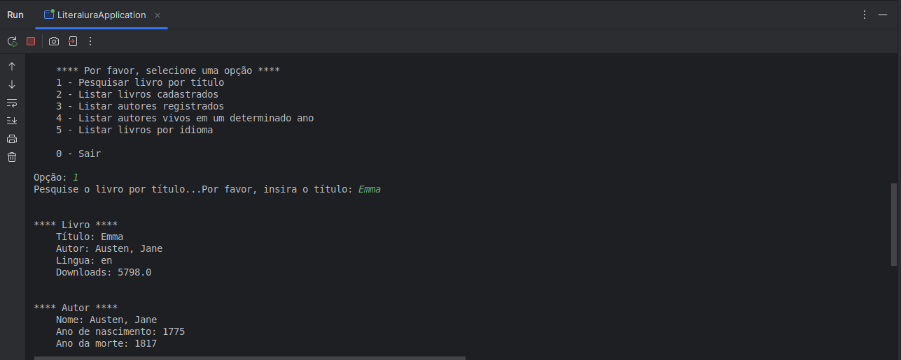
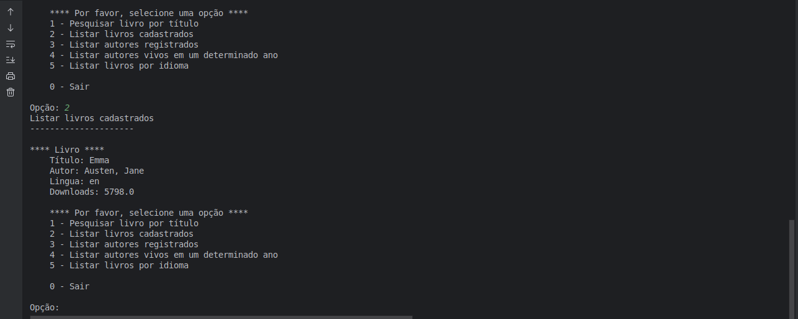

# LiterAlura - Challenge ONE

## Oracle Next Education + Alura

## Descrição

A API Literalura é um projeto desenvolvido como parte do challenge do programa Oracle Next Education (ONE).
Essa API é construída utilizando o Java com Spring Boot e tem como objetivo implementar uma plataforma de gerenciamento de livros e autores.

## Funcionalidades

1. **Pesquisar livro por título**: Consulta a API Gutendex para buscar livros pelo título.
2. **Listar livros cadastrados**: Exibe todos os livros registrados no banco de dados.
3. **Listar autores registrados**: Exibe todos os autores dos livros registrados.
4. **Listar autores vivos em um determinado ano**: Lista autores que estavam vivos em um ano especificado.
5. **Listar livros por idioma**: Lista livros registrados no banco de dados em um idioma especificado.
0. **Encerrar a aplicação**: Encerra o programa.

## Tecnologias Utilizadas

- **Java 17**
- **Spring Boot**
- **PostgreSQL**
- **Maven**
- **Docker**
- **API Gutendex**

### Imagens

 

### Contruibuição

- Para contribuir, bifurque este repositório e envie suas alterações por meio de pull requests.
- Para relatórios de bugs ou sugestões de melhorias, abra um problema na página do projeto.